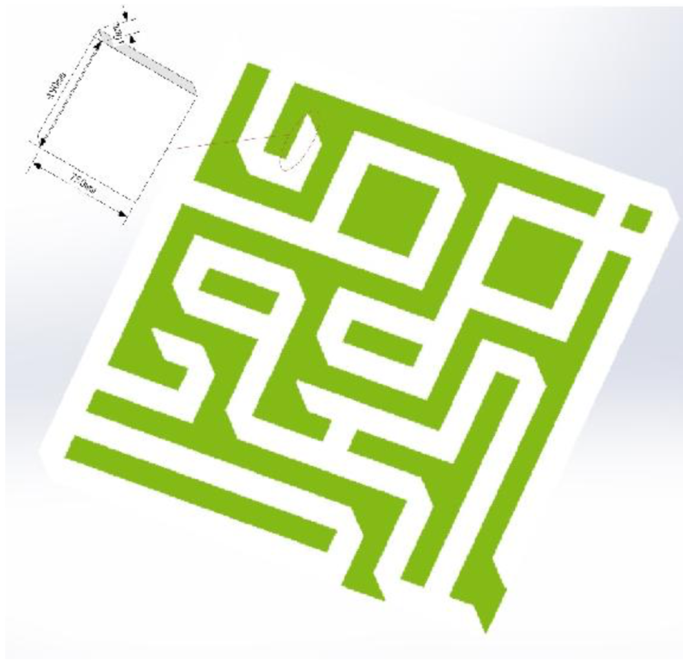
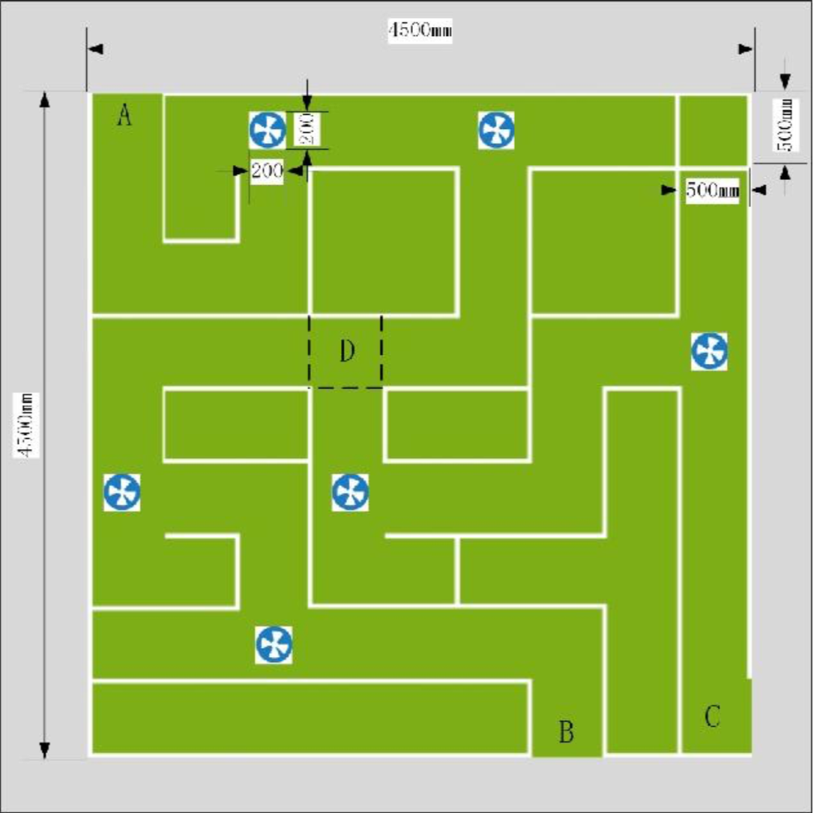

## Nao_Labyrinth

#### 1.Goal
Help Robot Nao find the exit of a given labyrinth.

#### 2.Field Construction
The field consists  artificial turf mounted on a flat wooden base with a total area of length 4.5m and width 4.5m. Several 0.75m height partions divide the field to 9x9 squares with length of 0.5m. Due to the 0.1m depth of each partion, the actual width of the way is 0.48m.

There three exits A,B,C in the field, two of them will be start and end at random. One edge of sqaure D will be put a partion to correspond to the exits chosen.

